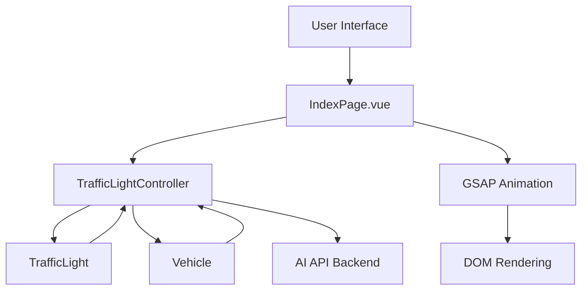
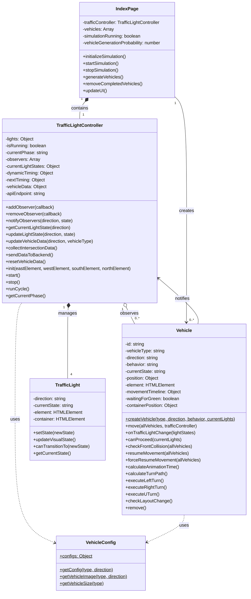
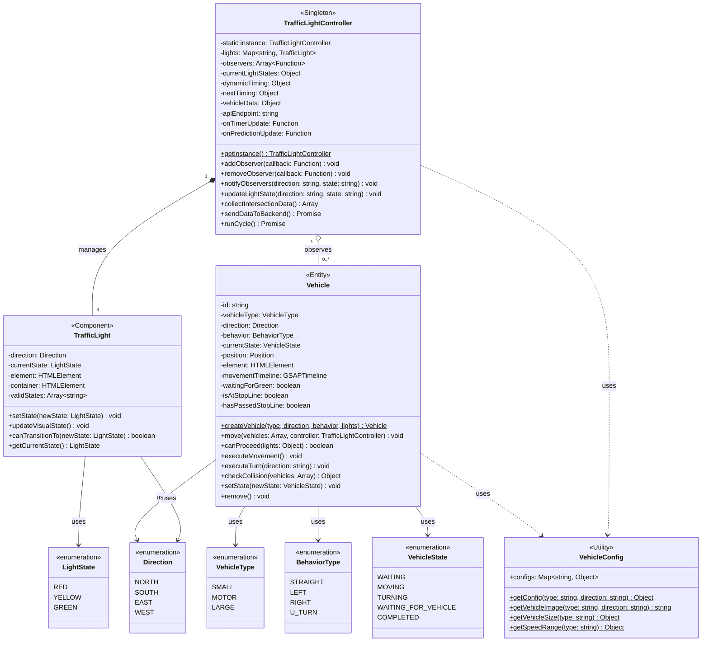

# 系統架構總覽

## 🎯 系統目標

本系統是一個基於人工智慧的智能交通燈控制模擬平台，主要目標包括：

1. **交通流量最佳化**：透過 AI 預測調整燈號時序，減少車輛等待時間
2. **真實場景模擬**：提供接近真實的車輛行為和交通環境模擬
3. **數據收集分析**：收集交通數據供 AI 學習和決策
4. **視覺化監控**：提供直觀的交通狀況顯示介面

## 🏗️ 整體架構

### 系統分層架構

```
┌─────────────────────────────────────────┐
│              使用者介面層                │
│    (Vue.js + Quasar Components)        │
├─────────────────────────────────────────┤
│              業務邏輯層                  │
│  TrafficLightController (核心控制器)    │
├─────────────────────────────────────────┤
│              實體模型層                  │
│  Vehicle (車輛)  │  TrafficLight (燈號) │
├─────────────────────────────────────────┤
│              數據通訊層                  │
│        API Integration (AI後端)        │
├─────────────────────────────────────────┤
│              動畫渲染層                  │
│        GSAP Animation Engine            │
└─────────────────────────────────────────┘
```

### 核心組件關係



### 系統類別圖



### 詳細類別結構圖



## 🔄 系統運作流程

### 1. 初始化階段

1. **頁面載入**：IndexPage.vue 初始化交通模擬環境
2. **控制器創建**：建立 TrafficLightController 實例
3. **燈號設置**：創建四個方向的 TrafficLight 實例
4. **場景準備**：設定車道、路口等視覺元素

### 2. 模擬運行階段

1. **車輛生成**：根據設定的機率產生不同類型車輛
2. **行為計算**：車輛根據燈號狀態決定行為（停止/前進/轉彎）
3. **動畫執行**：GSAP 處理車輛移動和轉彎動畫
4. **狀態更新**：持續更新車輛位置和交通狀況

### 3. AI 決策階段

1. **數據收集**：TrafficLightController 收集當前交通數據
2. **API 呼叫**：將數據發送至 AI 後端進行分析
3. **決策回應**：接收 AI 的燈號切換建議
4. **狀態執行**：根據 AI 建議調整交通燈狀態

## 📊 數據流向

### 輸入數據

- **使用者設定**：車輛生成機率、模擬參數
- **即時狀態**：當前燈號、車輛位置、等待隊列

### 處理數據

- **車輛統計**：各方向車輛數量、類型分佈
- **等待時間**：各車道平均等待時間
- **流量密度**：路口車流密度分析

### 輸出數據

- **視覺呈現**：動態車輛移動、燈號變化
- **AI 輸入**：格式化的交通數據
- **統計資訊**：交通效能指標

## 🎮 使用者互動

### 控制介面

- **模擬控制**：開始/暫停/重置模擬
- **參數設定**：調整車輛生成機率、場景參數
- **視覺切換**：開啟/關閉可視化效果
- **數據顯示**：查看即時交通統計

### 即時回饋

- **視覺指示**：車輛狀態、燈號變化
- **數據更新**：即時交通統計顯示
- **狀態提示**：系統運行狀態指示

## 🔧 技術特點

### 高效能渲染

- **GSAP 優化**：使用硬體加速的動畫引擎
- **DOM 管理**：最小化 DOM 操作提升效能
- **狀態管理**：精確的狀態更新機制

### 模組化設計

- **職責分離**：每個類別有明確的職責範圍
- **低耦合度**：組件間透過介面通訊
- **高內聚性**：相關功能集中在同一模組

### 可擴展性

- **設計模式**：使用多種設計模式提升可維護性
- **介面標準**：標準化的 API 介面設計
- **配置驅動**：透過配置檔案調整系統行為

這個架構設計確保了系統的穩定性、效能和可維護性，為未來的功能擴展和優化提供了良好的基礎。

```

```
